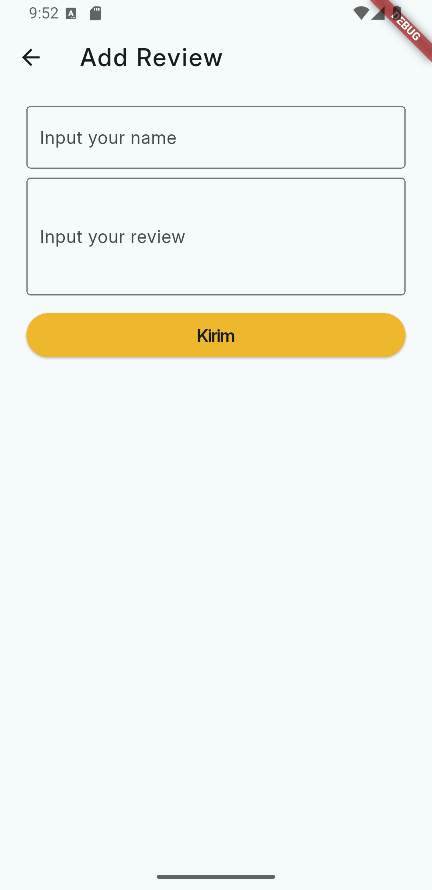

# Restaurant App 🍽️  

[](https://flutter.dev)  
[](#)  

Submission project untuk kelas [Belajar Fundamental Aplikasi Flutter](https://www.dicoding.com/academies/195).  

Aplikasi ini menampilkan daftar informasi restoran yang diambil dari **[Dicoding Restaurant API](https://restaurant-api.dicoding.dev/)**.  
Beberapa fitur yang tersedia meliputi **pencarian restoran, manajemen favorit, pengaturan tema (dark/light), hingga notifikasi harian.**  

---

## 🎨 UI Design  

Desain UI aplikasi ini diadaptasi dari desain komunitas Figma:  

👉 [Restaurant Finder App (Figma)](https://www.figma.com/community/file/1332689688431819471) karya **Kirtika Arora**.  

---

## ✨ Fitur Aplikasi  

### 🏠 Home  
Halaman **Home** menampilkan daftar restoran populer dari API.  
- Daftar restoran ditampilkan dalam bentuk list dengan gambar, nama, rating, dan kota.  
- Data otomatis diambil dari API saat aplikasi pertama kali dijalankan.  
- Jika tidak ada koneksi internet, aplikasi menampilkan pesan error/informasi yang sesuai.  

<p style="margin-top:30px">
  
  
</p>  

---

### 🔍 Search  
Halaman **Search Restaurants** memungkinkan pengguna mencari restoran berdasarkan kata kunci.  
- Pencarian dilakukan secara real-time menggunakan API.  
- Jika kata kunci tidak ditemukan, aplikasi menampilkan pesan bahwa restoran tidak tersedia.  
- Input pencarian ditangani menggunakan **Provider** agar UI dapat otomatis ter-update.  

<p style="margin-top:30px">
  
  
</p> 

---

### ❤️ Favorit  
Halaman **Favorit** menyimpan daftar restoran yang dipilih pengguna sebagai favorit.  
- Data favorit disimpan secara **lokal menggunakan SQLite (sqflite)** sehingga tetap tersimpan meski aplikasi ditutup.  
- Pengguna dapat menambahkan/menghapus favorit melalui tombol di halaman detail restoran.  

<p style="margin-top:30px">
  
  
</p>

---

### ⚙️ Settings  
Halaman **Settings** menyediakan dua pengaturan utama:  
1. **Tema Aplikasi** → pengguna dapat memilih mode **Dark** atau **Light**.  
2. **Daily Notification** → pengguna dapat mengaktifkan notifikasi harian yang akan muncul setiap pukul **11.00 AM**.  

<p style="margin-top:30px">
  
  
</p> 

---

### 📝 Detail Restaurant  
Halaman detail menampilkan informasi lengkap dari restoran yang dipilih.  
Fitur yang tersedia di halaman ini:  
- **Informasi Lengkap**: gambar, nama, rating, deskripsi, alamat, kategori, daftar menu makanan, minuman, dan daftar review.  
- **Favorit**: tombol favorit untuk menambahkan atau menghapus restoran dari daftar favorit.  
- **Review**: tombol review untuk navigasi ke halaman review 

<p style="margin-top:30px">
  
  
</p> 

---

### 🗣️ Review  
Halaman **Review** memungkinkan pengguna menambahkan ulasan untuk restoran tertentu.  
- Input berupa nama & review pengguna.  
- Review baru akan dikirim ke server API dan ditampilkan di halaman detail restoran.  

<p style="margin-top:30px">
  
  
</p>

---

## 🚀 Cara Menjalankan Aplikasi  

1. Clone repository ini:  
   ```bash
   git clone https://github.com/bayutp/dicoding-flutter-fundamental.git
   cd dicoding-flutter-fundamental
2. **Install dependency Flutter**
    ```bash
    flutter pub get
3. **Jalankan aplikasi di emulator atau perangkat fisik**
    ```bash
    flutter run

## 📦 Packages yang Digunakan  

- [`http`](https://pub.dev/packages/http) → Mengambil data dari Dicoding Restaurant API.  
- [`provider`](https://pub.dev/packages/provider) → State management untuk mengatur data & UI.  
- [`shared_preferences`](https://pub.dev/packages/shared_preferences) → Menyimpan preferensi pengguna (contoh: tema & notification).  
- [`sqflite`](https://pub.dev/packages/sqflite) → Database lokal untuk menyimpan data restoran favorit.
- [`flutter_timezone`](https://pub.dev/packages/flutter_timezone) → Menentukan setup zona waktu untuk notifikasi agar sesuai dengan perangkat pengguna. 
- [`flutter_local_notifications`](https://pub.dev/packages/flutter_local_notifications) → Menampilkan notifikasi harian.  
- [`workmanager`](https://pub.dev/packages/workmanager) → Menjadwalkan background task (notifikasi otomatis).  

---

## 🧪 Testing  

Aplikasi ini mencakup tiga jenis testing:  

- **Unit Test** → Menguji fungsi di dalam provider (list, search, detail).  
- **Widget Test** → Menguji UI komponen saat aplikasi pertama kali dijalankan.  
- **Integration Test** → Menguji alur aplikasi (navigasi bottom navigation, interaksi favorit, dll).  


## 📄 Lisensi & Penggunaan Source Code

Source code ini bebas digunakan untuk belajar dan referensi pribadi.
Namun, dilarang mengirimkan ulang proyek ini secara langsung (tanpa modifikasi signifikan) sebagai submission di kelas [Belajar Fundamental Aplikasi Flutter](https://www.dicoding.com/academies/195) di Dicoding.

Silakan gunakan sebagai inspirasi dan kembangkan sesuai gaya & ide kreatifmu sendiri.